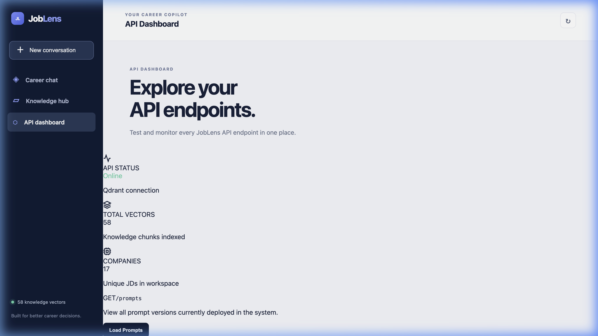
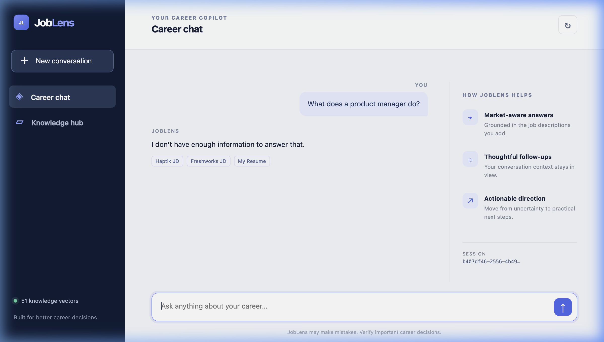
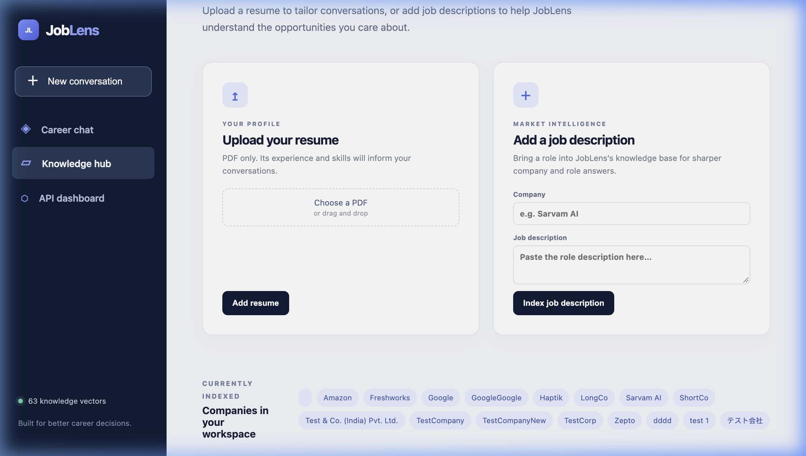

# 🔎 JobLens
### AI-Powered Job Market Intelligence & Career Assistant

> **Understand the job market. Identify skill gaps. Improve your resume. Find better opportunities.**

JobLens is an **AI-powered job market intelligence platform** designed to help tech professionals interact with job-market data and resumes using natural language, built using **FastAPI**, **LangGraph**, **LangChain**, and **Qdrant**, with a beautiful **Dockerized Frontend UI**.

---

## ✨ Features

- 🔍 **Semantic Job Search**: Query the job market naturally.
- 📄 **Resume Analysis & Comparison**: Identify missing skills by comparing your resume to job requirements.
- 🤖 **LangGraph Career Agent**: Multi-step AI reasoning that self-corrects bad retrieval automatically.
- 🧠 **Persistent Memory**: Conversational memory that remembers context.
- 📊 **API Dashboard**: A premium KPI dashboard to monitor vector chunks, health, and manage data.
- 🐳 **Fully Dockerized**: Effortlessly spin up the entire application (API, UI, Vector Store) in one command.

---

## 📸 Screenshots

### The KPI Dashboard
Monitor your API health, vector database status, and easily remove indexed job descriptions.


### The Career Assistant Chat
Interact with the LangGraph agent for personalized career advice based on indexed JDs and Resumes.


### Seamless Data Indexing
Index thousands of chunks into the Qdrant vector database via the UI.


---

## 🚀 Getting Started

JobLens is extremely easy to run thanks to Docker. The backend FastAPI service and the frontend UI are served together out of the box.

### Prerequisites
- Docker & Docker Compose
- API Keys (Groq, HuggingFace, Qdrant - if using Qdrant Cloud)

### 1. Clone the repository
```bash
git clone https://github.com/sAadhish/joblens.git
cd joblens/joblens
```

### 2. Configure Environment Variables
Copy the example environment file and fill in your API keys:
```bash
cp .env.example .env
```
Ensure you have added your `GROQ_API_KEY` and `QDRANT_API_KEY` to the `.env` file.

### 3. Run with Docker 🐳
Launch the entire application in detached mode using Docker Compose:
```bash
docker compose up -d
```
Docker will automatically download the necessary dependencies, mount the frontend directory, and expose the application.

### 4. Access the App
Once the container is up and running, simply open your browser to:
👉 **[http://localhost:8081/app/](http://localhost:8081/app/)**

To stop the application, run:
```bash
docker compose down
```

---

## 🏗️ Architecture

JobLens is built on a modern AI stack:

- **Frontend**: Vanilla JS/HTML/CSS with glassmorphism UI served statically.
- **API**: FastAPI providing high-performance async endpoints.
- **Agent Orchestration**: LangGraph (for multi-step reasoning, tool usage, and self-correction).
- **RAG & Embeddings**: LangChain with HuggingFace `bge-base-en-v1.5` embeddings.
- **Vector Database**: Qdrant Cloud for payload filtering and similarity search.
- **LLM**: Llama-3.3-70B via Groq API for lightning-fast inference.
- **Observability**: LangSmith integrated out-of-the-box.

```text
 ┌─────────────────┐       ┌─────────────────┐       ┌─────────────────┐
 │                 │       │                 │       │                 │
 │   Frontend UI   ├──────►│   FastAPI App   ├──────►│ LangGraph Agent │
 │                 │       │                 │       │                 │
 └─────────────────┘       └─────────────────┘       └────────┬────────┘
                                                              │
                                                     ┌────────▼────────┐
                                                     │                 │
                                                     │ Qdrant VectorDB │
                                                     │                 │
                                                     └─────────────────┘
```

---

## 🛠️ Development & Manual Run

If you want to run the application locally without Docker (e.g. for development):

1. **Activate your virtual environment**:
```bash
python -m venv venv
source venv/bin/activate
pip install -r requirements.txt
```

2. **Run the Uvicorn Server**:
Make sure you include the PYTHONPATH so imports resolve correctly:
```bash
PYTHONPATH="$(pwd):$(pwd)/joblens_langchain" uvicorn api.main:app --host 127.0.0.1 --port 8080 --reload
```
You can then access the app at `http://127.0.0.1:8080/app/`.

---
*Built with curiosity, iteration, and a lot of debugging. 🚀*